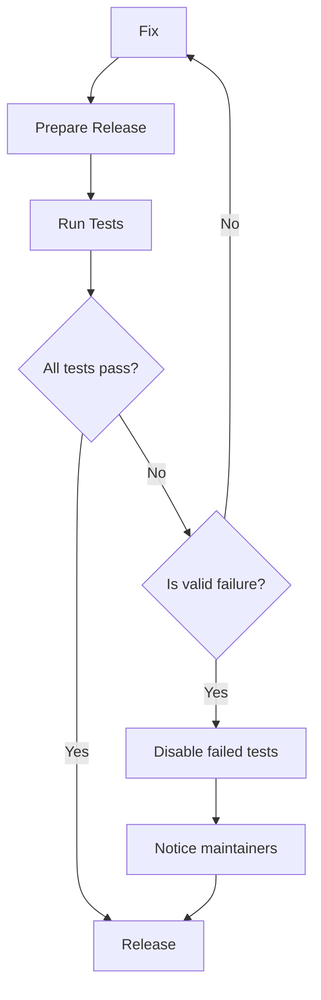

# @volar/ecosystem-ci

This repository is a fork of https://github.com/vitejs/vite-ecosystem-ci

If your project is using modules under Volar, you can add a test for your project, and we will execute it before each release to ensure that the new version does not cause unexpected regressions to your repo.

In addition, if there is a breaking change in the new release that breaks your test, we can notify you in time.

## Valid failure

Test failure in 3 cases does not prevent releasing.

1. Failure is not due to Volar update
2. Volar's update found other expected bugs in your project
3. Releasing a breaking version (v1.0 -> v1.1 or v1.1 -> v2.0), and all fails is expected

When your test fails, if it is a valid failure, we will open a PR temporarily disable your test and notify you. When your project can pass the test again, you can notify us or submit a PR to enable it again.

## Workflow

